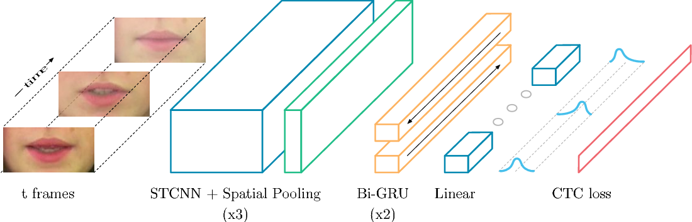
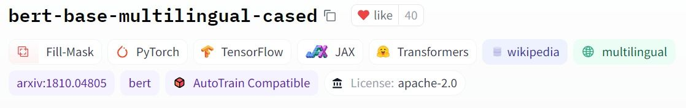

# Portfolio
---
## Computer Vision

### LipNet
Lipreading is the task of decoding text from the movement of a speaker's mouth. Traditional approaches separated the problem into two stages: designing or learning visual features, and prediction. More recent deep lipreading approaches are end-to-end trainable (Wand et al., 2016; Chung & Zisserman, 2016a). However, existing work on models trained end-to-end perform only word classification, rather than sentence-level sequence prediction

My complete implementation of LipNet:- 

**Lip Reading App with Python Tensorflow and Streamlit:** This a step further and build it out into a full stack application using
streamlit python tensorflow  ([GitHub](https://github.com/pininduwk/LipNet/tree/main/app)).

---
### PointNet for 3D Object Classification in PyTorch

In this project, I implemented a deep learning model called PointNet for 3D object classification using PyTorch. The PointNet model takes a set of 3D points that represent an object as input and outputs a label indicating the object's class. To train and test the model, I used a dataset of 3D shapes.

I loaded the dataset, preprocessed the data, defined and trained the PointNet model, and evaluated its performance on the test set. Additionally, I included visualization code to help understand the model's output.

By working on this project, I gained experience with implementing a deep learning model for 3D object classification using PyTorch and learned how to preprocess and visualize 3D data.

---

## Natural language processing 

### Training BERT Text Classifier on Tensor Processing Unit (TPU)

In this project, I fine-tuned the BERT language model using TensorFlow on Arabizi language text data. I modified the model architecture to improve its performance and trained it using Google's TPUs, which reduced the training time significantly. By completing this project, I gained experience in processing text data, using TensorFlow, and working with TPUs.

---
### Detect Non-negative Airline Tweets: BERT for Sentiment Analysis

The release of Google's BERT is described as the beginning of a new era in NLP. In this notebook I'll use the HuggingFace's transformers library to fine-tune pretrained BERT model for a classification task. Then I will compare BERT's performance with a baseline model, in which I use a TF-IDF vectorizer and a Naive Bayes classifier. The transformers library helps us quickly and efficiently fine-tune the state-of-the-art BERT model and yield an accuracy rate 10% higher than the baseline model.

---
### Predict Breast Cancer with RF, PCA and SVM using Python

In this project I am going to perform comprehensive EDA on the breast cancer dataset, then transform the data using Principal Components Analysis (PCA) and use Support Vector Machine (SVM) model to predict whether a patient has breast cancer.

 

 

---
